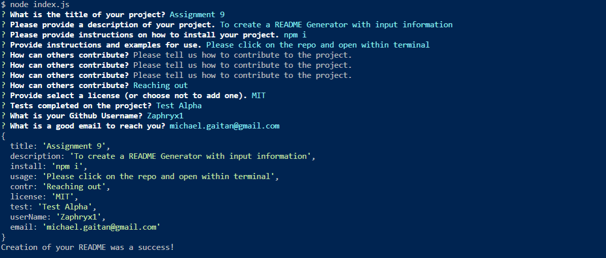

# README Generator

## Badges

## Table of Contents:

-   [Installation](#installation)
-   [Usage](#usage)
-   [Credits](#credits)
-   [License](#license)

## Description:

This application is to prompt questions to the user and plug that information to create a new README with all the user's responses. This application uses packages downloaded from node and npm.

## Installation

Please open integrated terminal in the root folder by using "npm i". Once the packages have been installed, please input "node index.js" to begin the question prompts.

## Usage
Mainly to create a quick README to save the user time and typing out a fresh README everytime.

## How to Contribute

Please reach out to me in the following section.

## Questions

https://github.com/Zaphryx1/

You can reach at:

Email: michael.gaytan@gmail.com

## Tests
None performed.

    

